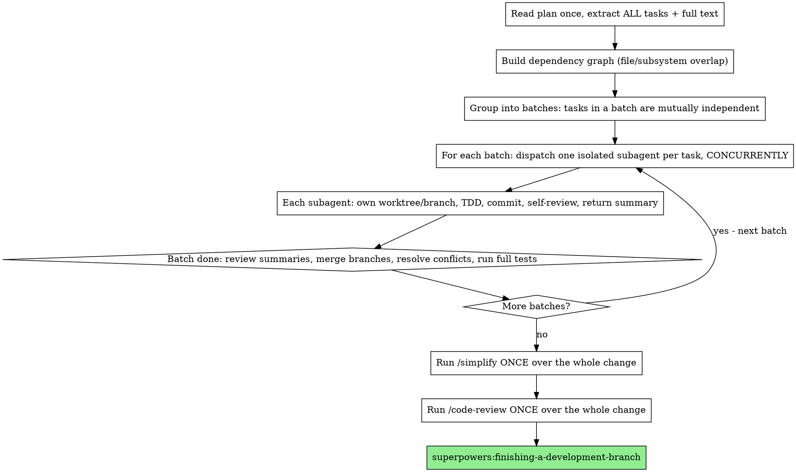

# Parallel Plan Execution

## Overview

Take the spec/plan currently being executed and run its independent tasks
**concurrently** across isolated subagents, then converge with a single
`/simplify` and a single `/code-review`.

**Core principle:** Maximum throughput WITHOUT correctness loss. Parallelism is
only safe between tasks that do not share files or have ordering dependencies —
so the whole job is building correct dependency batches, dispatching each batch
wide, and gating each batch on a clean merge before the next.

This skill REPLACES the one-task-at-a-time loop of
superpowers:subagent-driven-development for the current execution. It does not
replace the per-task quality bar — every parallel task still implements with
tests and self-reviews.

**REQUIRED BACKGROUND:**
- superpowers:dispatching-parallel-agents — how to scope and fan out concurrent agents
- superpowers:using-git-worktrees — the isolation that makes parallel writes safe

## When to Use

- A written plan/spec is mid-execution (or about to start) and the user wants speed.
- The plan has 2+ tasks that touch **different files / subsystems**.

**Do NOT parallelize (run sequentially) when:**
- Tasks edit the same file or the same function.
- Task B's input is Task A's output (real ordering dependency).
- There is only one task. Then just execute it; the converge step still applies.

When unsure whether two tasks are independent, treat them as dependent. A wrong
parallel guess corrupts the tree; a wrong sequential guess only costs time.

## The Process

## Steps

1. **Extract all tasks.** Read the plan ONCE. Pull every task's full text +
   context into a TodoWrite list. Subagents never read the plan file — you hand
   them exactly the text and context they need.

2. **Batch by independence.** For each pair of tasks, ask: do they write the
   same files or depend on each other's output? Independent tasks go in the same
   batch. Dependent tasks go in later batches. A batch of size 1 is allowed.

3. **Dispatch the batch concurrently.** Send all subagent calls for a batch **in
   a single message** so they run at once. Each subagent gets:
   - Its own worktree/branch (isolation — required for parallel writes; see
     superpowers:using-git-worktrees).
   - Full task text + scene-setting context.
   - Constraints: touch only its assigned files; do NOT edit other tasks' files.
   - Mandate: write tests, implement, run tests, commit, self-review.
   - Required return: summary of root cause/approach, files changed, test result.

4. **Converge the batch (barrier).** Wait for ALL subagents in the batch. Read
   each summary, merge branches into the working branch, resolve any conflicts,
   run the FULL test suite. Only then start the next batch — its tasks may depend
   on this batch's merged result.

5. **Handle subagent status** exactly as superpowers:subagent-driven-development
   prescribes (DONE / DONE_WITH_CONCERNS / NEEDS_CONTEXT / BLOCKED). Re-dispatch
   with more context or a stronger model; never silently drop a blocked task.

6. **Simplify once.** After the LAST batch merges clean, run `/simplify` a single
   time across the entire combined change — not per task. One pass catches
   cross-task duplication that per-task passes miss.

7. **Code-review once.** Then run `/code-review` a single time over the whole
   change. Address findings, then proceed to
   superpowers:finishing-a-development-branch.

## Quick Reference

| Thing | Rule |
|-------|------|
| What runs in parallel | Tasks in the same batch (mutually independent) |
| What forces sequencing | Shared files OR output dependency → separate batches |
| Isolation | One worktree/branch per concurrent subagent |
| Dispatch | All of a batch's agents in ONE message (true concurrency) |
| Barrier | Merge + full test suite between batches |
| `/simplify` | Exactly ONCE, after all batches merge |
| `/code-review` | Exactly ONCE, after `/simplify` |
| Per-task quality | Still TDD + self-review inside every subagent |

## Common Mistakes

- **Parallelizing dependent tasks.** Two agents editing the same file in separate
  worktrees → merge conflict or lost work. Batch them sequentially instead.
- **Dispatching agents across multiple messages.** They serialize. Put a batch's
  calls in one message.
- **Skipping the merge/test barrier between batches.** A later batch built on an
  unmerged, untested earlier batch compounds errors.
- **Running `/simplify` or `/code-review` per task.** The point of converging is
  ONE simplify and ONE review over the whole change. Per-task runs miss
  cross-task issues and waste passes.
- **Letting subagents read the plan or each other's work.** Controller curates
  context. Subagents stay isolated.

## Red Flags — STOP

- About to send two agents that both write `foo.go` concurrently → re-batch.
- About to start batch N+1 before batch N is merged + tests green → halt, converge first.
- About to run `/simplify` while batches remain → finish all batches first.
- Tempted to skip `/code-review` because "agents self-reviewed" → self-review ≠ final review. Run it.
